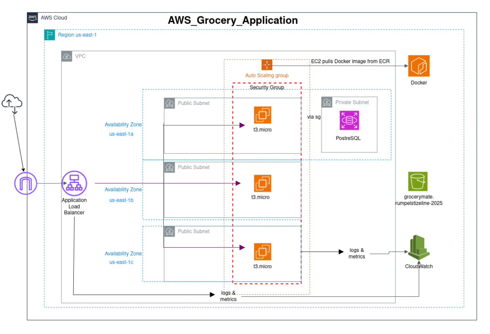

# GroceryMate on AWS ☁️🛒

## 1. Application Description

GroceryMate is an application originally developed by **Alejandro Roman Ibanez** as part of the Masterschool program.  
This project extends his work by deploying the application on the **AWS Cloud** using **Infrastructure as Code (IaC)** with Terraform.  

The application itself is a modern, full-featured **e-commerce platform** designed for seamless online grocery shopping. It provides an intuitive user interface and a secure backend, allowing users to browse products, manage their shopping basket, and complete purchases efficiently.  

### 🛒 Features
- 🛡️ **User Authentication**: Secure registration, login, and session management  
- 🔒 **Protected Routes**: Access control for authenticated users  
- 🔎 **Product Search & Filtering**: Browse products, apply filters, and sort by category or price  
- ⭐ **Favorites Management**: Save preferred products  
- 🛍️ **Shopping Basket**: Add, view, modify, and remove items  
- 💳 **Checkout Process**:  
  - Secure billing and shipping information handling  
  - Multiple payment options  
  - Automatic total price calculation  

---

## 2. AWS Deployment (Infrastructure Layer)

The infrastructure for GroceryMate is defined with **Terraform** and located in the [`infrastructure/`](infrastructure) folder.  
It provisions a complete cloud-native environment with load balancing, auto scaling, monitoring, and persistent storage.

### 2.1 AWS Resources Used
- **Amazon EC2 (Auto Scaling Group)** – runs Docker containers of the GroceryMate app; scales in/out automatically  
- **Amazon ECR (Elastic Container Registry)** – stores the Docker image for the application  
- **Amazon ALB (Application Load Balancer)** – distributes traffic across EC2 instances in multiple Availability Zones  
- **Amazon RDS (PostgreSQL)** – managed relational database service for application data (deployed in a private subnet)  
- **Amazon S3** – stores static assets (e.g., product images, uploads)  
- **Amazon CloudWatch** – monitors application and infrastructure metrics, with alarms for scaling  
- **IAM Roles** – grant EC2 and ECS access to ECR and CloudWatch  
- **Security Groups** – control inbound/outbound traffic (e.g., ALB open to HTTP/HTTPS, EC2 restricted, RDS private)  
- **VPC (Default)** – networking environment with public and private subnets  

---

## 3. Architecture Diagram

The updated cloud architecture is illustrated below:



### Key Points:
- Users access the app through the **Application Load Balancer**  
- ALB routes traffic to the **EC2 Auto Scaling Group** (running Docker containers)  
- EC2 instances connect to the **RDS PostgreSQL** database in a private subnet  
- **S3 bucket** provides static file storage  
- **CloudWatch** collects logs/metrics and triggers scaling policies  

---

## 4. Repository Structure


```bash
AWS_grocery/
│
├── app/                        # Core GroceryMate application code
├── backend/                    # Dockerfile for containerizing the application
├── infrastructure/             # Terraform IaC configurations
│   ├── asg-and-launch-template.tf
│   ├── cloudwatch.tf
│   ├── data-and-common.tf
│   ├── ec2.tf
│   ├── ecr-and-iam.tf
│   ├── outputs.tf
│   ├── providers.tf
│   ├── rds.tf
│   ├── s3.tf
│   ├── security-and-alb.tf
│   └── variables.tf
└── README.md
```

# Project documentation

## 5. Getting Started
### 5.1 Prerequisites

AWS Account with permissions for EC2, RDS, S3, IAM, ALB, CloudWatch, and ECR

Installed tools:

AWS CLI (v2 or higher), configured with SSO or IAM credentials

Terraform (>= 1.6.0)

Git

Docker (to build and push images)

A valid SSH Key Pair for EC2 access (create via AWS Console or CLI)

### 5.2 Deployment Steps

Clone this repository

```
git clone git@github.com:Rumpelstilzeline/AWS_grocery.git
cd AWS_grocery/infrastructure
```

Initialize Terraform

```
terraform init
```

Configure variables
Adjust values in terraform.tfvars (create this file if missing):

region → AWS region (e.g., us-east-1)

key_name → SSH key pair name (as in AWS Console)

my_ip_cidr → Your public IP in CIDR format (e.g., 84.57.145.46/32)

db_name, db_username, db_password → Database credentials

bucket_name → Globally unique S3 bucket name

Any scaling parameters (min/max instance count, desired capacity)

Build & Push Docker image to ECR

```
cd ../backend
aws ecr get-login-password --region us-east-1 | docker login --username AWS --password-stdin <your_account_id>.dkr.ecr.us-east-1.amazonaws.com
docker build -t grocery-app .
docker tag grocery-app:latest <your_account_id>.dkr.ecr.us-east-1.amazonaws.com/grocery-app:latest
docker push <your_account_id>.dkr.ecr.us-east-1.amazonaws.com/grocery-app:latest
```
Provision the infrastructure
```
cd ../infrastructure
terraform plan -out plan.out
terraform apply plan.out
```
Verify deployment

Run terraform output alb_dns_name to get the Application Load Balancer URL

Open the URL in your browser → GroceryMate should be available

Confirm:

EC2 instances are running inside an Auto Scaling Group

RDS database is created and reachable from EC2s

S3 bucket exists

CloudWatch monitors ASG/EC2

# 6. Cleanup

To avoid costs, destroy all resources when finished:

```
terraform destroy
```

If some resources (like security groups or ECR repos with images) cannot be destroyed automatically, delete them manually via the AWS Console.

# 7. Credits

Original application: Alejandro Roman Ibanez

AWS deployment and Terraform IaC: Rumpelstilzeline
